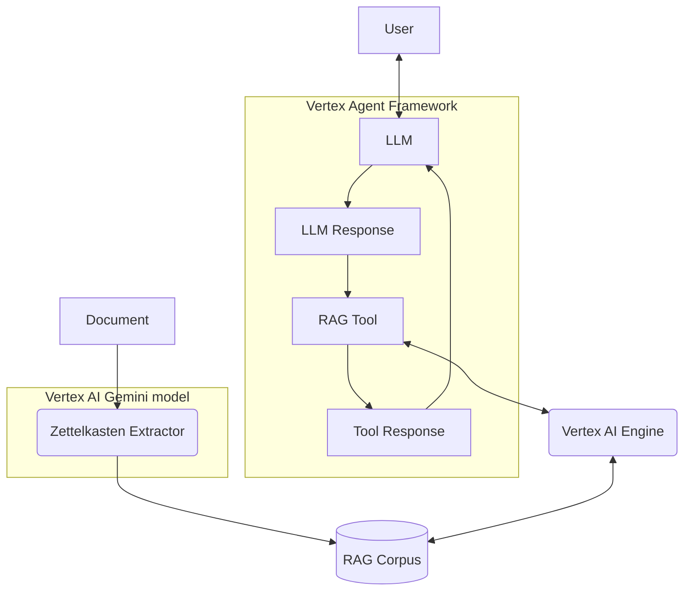
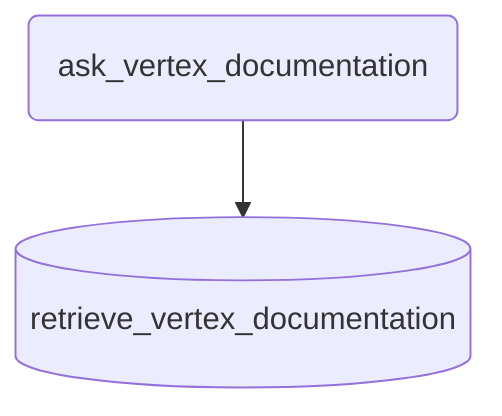

# Zettelkasten RAG (Retrieval Augmented Generation)

Second Brain Google ADK agent that creates a RAG corpus of Zettelkasten cards from a source and then use RAG to query the cards.

## Motivation

This Agent was created in less than a day as a response to AICamp's ["Dive into AI Agents: A 9-Day Collaborative Study Challenge"](https://oehkebnm.manus.space)

Details on the challenge:
* Embark on a 9-day journey to explore the world of AI agents. This is a hands-on study group for anyone interested in building AI agents, where we learn and build together.
* Challenge Dates: May 24th - June 1st, 2025
* Duration: 9 days

This agent uses the Google Agent Development Kit (google-adk) and is based on the [Documentation Retrieval Agent sample](https://github.com/google/adk-samples/tree/main/python/agents/RAG), with modifications made using "vibe coding" in VS Code using the Gemini Code Assist.

## Overview

This is a Second Brain agent designed to answer questions related to Zettelkasten cards uploaded to Vertex AI RAG Engine. It reads documents and extract key facts into Zettelkasten cards using an LLM and uploads these cards to the Vertex AI RAG Engine. It utilizes Retrieval-Augmented Generation (RAG) with the Vertex AI RAG Engine to fetch relevant cards, which are then synthesized by an LLM (Gemini) to provide informative answers with citations.

The idea is that RAG tends to be inaccurate due to non optimal chunk size (what happens when the information is split across chunks and only one chunk is retrieved). This causes the RAG agent to give incorrect answers or hallucinate. The solution is take a first pass through the document and generate a set of Zettelkasten cards, each representing an atomic concept from the document. A RAG query is then used to retrieve cards, which should all be under the chunk size, and hopefully this will give a better more accurate model response to the query.



Initially Documents are processed using an LLM (Gemini Pro 2.5 Preview 05-06) into Zettelkasten Cards, which are then loaded into the RAG Corpus.

The diagram then outlines the agent's workflow, designed to provide informed and context-aware responses. User queries are processed by agent development kit. The LLM (Google Flash 2.5 Preview 05-26) determines if external knowledge (RAG corpus) is required. If so, the `VertexAiRagRetrieval` tool fetches relevant information from the configured Vertex RAG Engine corpus. The LLM then synthesizes this retrieved information with its internal knowledge to generate an accurate answer, including citations pointing back to the Zettelkasten cards. A future enhancement could link the Zettelkasten cards back to the original source document for additional grounding.

## Agent Details
| Attribute         | Details                                                                                                                                                                                             |
| :---------------- | :-------------------------------------------------------------------------------------------------------------------------------------------------------------------------------------------------- |
| **Interaction Type** | Conversational                                                                                                                                                                                      |
| **Complexity**    | Intermediate
| **Agent Type**    | Single Agent                                                                                                                                                                                        |
| **Components**    | Tools, RAG, Evaluation                                                                                                                                                                               |
| **Vertical**      | Horizontal                                                                                                                                                                               |
### Agent Architecture




### Key Features

*   **Retrieval-Augmented Generation (RAG):** Leverages [Vertex AI RAG
    Engine](https://cloud.google.com/vertex-ai/generative-ai/docs/rag-overview)
    to fetch relevant documentation.
*   **Citation Support:** Provides accurate citations for the retrieved content,
    formatted as URLs.
*   **Clear Instructions:** Adheres to strict guidelines for providing factual
    answers and proper citations.

## Setup and Installation Instructions
### Prerequisites

*   **Google Cloud Account:** You need a Google Cloud account.
*   **Python 3.11+:** Ensure you have Python 3.11 or a later version installed.
*   **UV:** Install UV by following the instructions on the official UV website: [https://docs.astral.sh/uv/](https://docs.astral.sh/uv/)
*   **Git:** Ensure you have git installed.

### Project Setup with UV

1.  **Clone the Repository:**

    ```bash
    git clone https://github.com/ChristineTham/zettelkasten-rag.git
    cd zettelkasten-rag
    ```

2.  **Install Dependencies with UV:**

    ```bash
    uv sync
    ```

    This command reads the `pyproject.toml` file and installs all the necessary dependencies into a virtual environment managed by UV.

    ```
3.  **Set up Environment Variables:**
    Rename the file ".env.example" to ".env"
    Follow the steps in the file to set up the environment variables.

4. **Setup Corpus:**
    If you have an existing corpus in Vertex AI RAG Engine, please set corpus information in your .env file. For example: RAG_CORPUS='projects/123/locations/us-central1/ragCorpora/456'.

    If you don't have a corpus setup yet, please follow "How to upload my file to my RAG corpus" section. The `create_second_brain.py` script will automatically create a corpus (if needed) and update the `RAG_CORPUS` variable in your `.env` file with the resource name of the created or retrieved corpus.

#### How to upload my file to my RAG corpus

The `rag/shared_libraries/create_second_brain.py` script helps you set up a RAG corpus and upload an initial document. By default, it downloads Alphabet's 2024 10-K PDF and uploads it to a new corpus.

1.  **Authenticate with your Google Cloud account:**
    ```bash
    gcloud auth application-default login
    ```

2.  **Set up environment variables in your `.env` file:**
    Ensure your `.env` file (copied from `.env.example`) has the following variables set:
    ```
    GOOGLE_CLOUD_PROJECT=your-project-id
    GOOGLE_CLOUD_LOCATION=your-location  # e.g., us-central1
    ```

3.  **Configure and run the preparation script:**
    *   **To use the default behavior (upload Alphabet's 10K PDF):**
        Simply run the script:
        ```bash
        uv run rag/shared_libraries/create_second_brain.py
        ```
        This will create a corpus named `Alphabet_10K_2024_corpus` (if it doesn't exist), download `goog-10-k-2024.pdf` from the URL specified in the script, and upload it to the corpus.

    *   **To upload a different PDF from a URL:**
        a. Open the `rag/shared_libraries/create_second_brain.py` file.
        b. Modify the following variables at the top of the script:
           ```python
           # --- Please fill in your configurations ---
           # ... project and location are read from .env ...
           CORPUS_DISPLAY_NAME = "Your_Corpus_Name"  # Change as needed
           CORPUS_DESCRIPTION = "Description of your corpus" # Change as needed
           PDF_URL = "https://path/to/your/document.pdf"  # URL to YOUR PDF document
           PDF_FILENAME = "your_document.pdf"  # Name for the file in the corpus
           # --- Start of the script ---
           ```
        c. Run the script:
           ```bash
           uv run rag/shared_libraries/create_second_brain.py
           ```

    *   **To upload a local PDF file:**
        a. Open the `rag/shared_libraries/create_second_brain.py` file.
        b. Modify the `CORPUS_DISPLAY_NAME` and `CORPUS_DESCRIPTION` variables as needed (see above).
        c. Modify the `main()` function at the bottom of the script to directly call `upload_zettelkasten_notes_to_corpus` with your local file details:
           ```python
           def main():
             initialize_vertex_ai()
             corpus = create_or_get_corpus() # Uses CORPUS_DISPLAY_NAME & CORPUS_DESCRIPTION

             # Upload your local PDF to the corpus
             pdf_path = "/path/to/your/local/file.pdf" # Set the correct path
             display_name = "Your_File_Name.pdf" # Set the desired display name

             # Ensure the file exists before uploading
             if os.path.exists(local_file_path):
                 upload_zettelkasten_notes_to_corpus(
                     corpus_name=corpus.name,
                     pdf_path=pdf_path,
                     source_pdf_display_name=display_name
                 )
             else:
                 print(f"Error: Local file not found at {local_file_path}")

             # List all files in the corpus
             list_corpus_files(corpus_name=corpus.name)
           ```
        d. Run the script:
           ```bash
           python rag/shared_libraries/create_second_brain.py
           ```

More details about managing data in Vertex RAG Engine can be found in the
[official documentation page](https://cloud.google.com/vertex-ai/generative-ai/docs/rag-quickstart).

## Running the Agent
You can run the agent using the ADK command in your terminal.
from the root project directory:

1.  Run agent in CLI:

    ```bash
    uv run adk run rag
    ```

2.  Run agent with ADK Web UI:
    ```bash
    uv run adk web
    ```
    Select the RAG from the dropdown


### Example Interaction
Here's a quick example of how a user might interact with the agent:

**Example 1: Document Information Retrieval**

User: According to the MD&A, how might the increasing proportion of revenues derived from non-advertising sources like Google Cloud and devices potentially impact Alphabet's overall operating margin, and why?

Agent: The increasing proportion of revenues from non-advertising sources like Google Cloud and devices could potentially decrease Alphabet's overall operating margin. This is because these non-advertising revenue streams generally have lower margins compared to advertising revenues, which can exert downward pressure on the company's operating margins.

Citations:
1) Zettel_Business_Trend_Increasing_Non_Advertising_Revenues_ed41cfb1.md
2) Zettel_Business_Trend_Diverse_Device_Access_and_New_Ad_Fo_8c668d05.md
3) Zettel_Risk_Potential_Decline_in_Revenue_Growth_and_Margi_9d8f27f1.md

## Deploying the Agent

The Agent can be deployed to Vertex AI Agent Engine using the following
commands:

```
python deployment/deploy.py
```

After deploying the agent, you'll be able to read the following INFO log message:

```
Deployed agent to Vertex AI Agent Engine successfully, resource name: projects/<PROJECT_NUMBER>/locations/us-central1/reasoningEngines/<AGENT_ENGINE_ID>
```

Please note your Agent Engine resource name and update `.env` file accordingly as this is crucial for testing the remote agent.

You may also modify the deployment script for your use cases.

## Testing the deployed agent

After deploying the agent, follow these steps to test it:

1. **Update Environment Variables:**
   - Open your `.env` file.
   - The `AGENT_ENGINE_ID` should have been automatically updated by the `deployment/deploy.py` script when you deployed the agent. Verify that it is set correctly:
     ```
     AGENT_ENGINE_ID=projects/<PROJECT_NUMBER>/locations/us-central1/reasoningEngines/<AGENT_ENGINE_ID>
     ```

2. **Grant RAG Corpus Access Permissions:**
   - Ensure your `.env` file has the following variables set correctly:
     ```
     GOOGLE_CLOUD_PROJECT=your-project-id
     RAG_CORPUS=projects/<project-number>/locations/us-central1/ragCorpora/<corpus-id>
     ```
   - Run the permissions script:
     ```bash
     chmod +x deployment/grant_permissions.sh
     ./deployment/grant_permissions.sh
     ```
   This script will:
   - Read the environment variables from your `.env` file
   - Create a custom role with RAG Corpus query permissions
   - Grant the necessary permissions to the AI Platform Reasoning Engine Service Agent

3. **Test the Remote Agent:**
   - Run the test script:
     ```bash
     python deployment/run.py
     ```
   This script will:
   - Connect to your deployed agent
   - Send a series of test queries
   - Display the agent's responses with proper formatting

The test script includes example queries about Alphabet's 10-K report. You can modify the queries in `deployment/run.py` to test different aspects of your deployed agent.

## Customization

### Customize Agent
You can customize system instruction for the agent and add more tools to suit your need, for example, google search.

### Customize Vertex RAG Engine
You can read more about [official Vertex RAG Engine documentation](https://cloud.google.com/vertex-ai/generative-ai/docs/rag-quickstart) for more details on customizing corpora and data.


### Plug-in other retrieval sources
You can also integrate your preferred retrieval sources to enhance the agent's
capabilities. For instance, you can seamlessly replace or augment the existing
`VertexAiRagRetrieval` tool with a tool that utilizes Vertex AI Search or any
other retrieval mechanism. This flexibility allows you to tailor the agent to
your specific data sources and retrieval requirements.


## Disclaimer

This agent is provided for illustrative purposes only and is not intended for production use. It serves as a basic example of an agent and a foundational starting point for individuals or teams to develop their own agents.

This sample has not been rigorously tested, may contain bugs or limitations, and does not include features or optimizations typically required for a production environment (e.g., robust error handling, security measures, scalability, performance considerations, comprehensive logging, or advanced configuration options).

Users are solely responsible for any further development, testing, security hardening, and deployment of agents based on this sample. We recommend thorough review, testing, and the implementation of appropriate safeguards before using any derived agent in a live or critical system.
